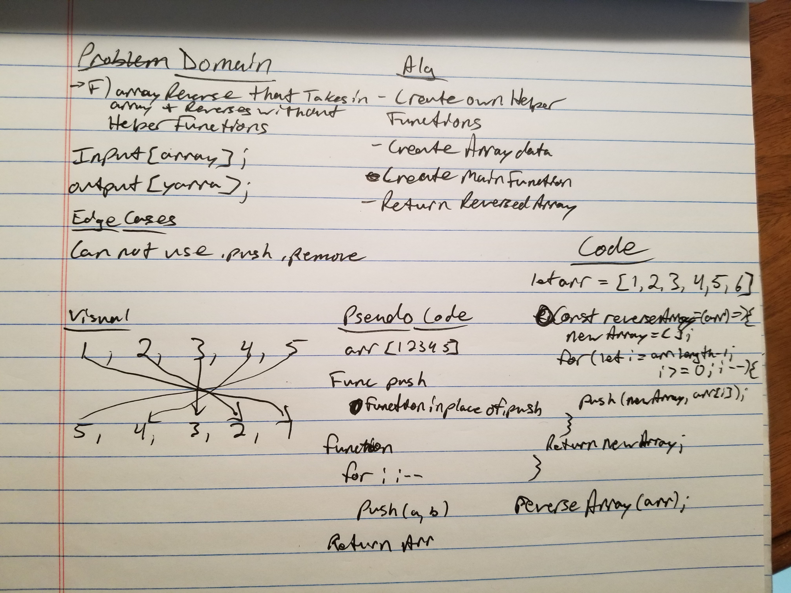

# Reverse an Array
- Challenge 01 - Array Reverse

## Challenge
- Take in array and reverse it without built in methods

## Approach & Efficiency
- Iterate through the array
- Create push function
- Start at back of array
- Push into new array
- Return finished array

## Solution
